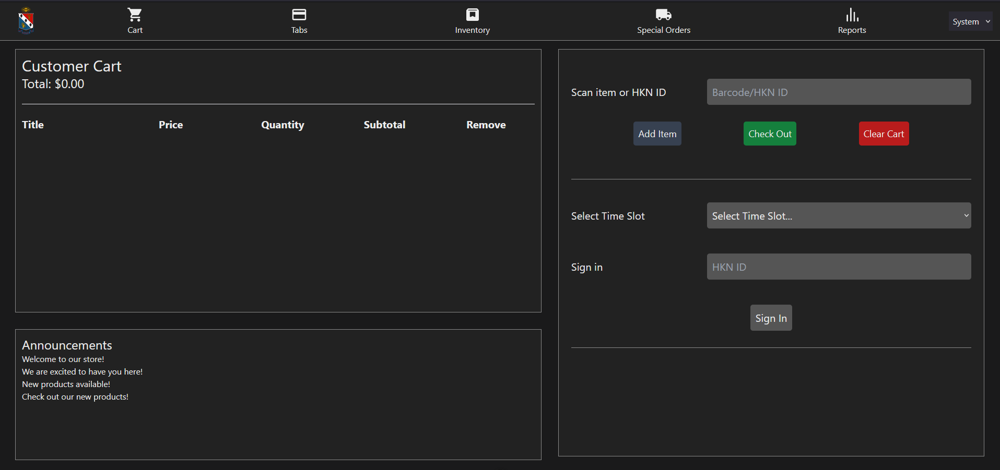

# Frontend/`storefront`

The `storefront` is the part of the point-of-sale software that members interact with daily.  It offers the following interfaces: 
- Regular POS interface where customers can purchase things, with cash or tabs.
- Manage customer tabs - creation or updation.
- Manage inventory - add, remove, or update items.
- Create special orders for the ECE department or other special events.
- Report statistics on sales, inventory, and other metrics.

The storefront was written in Nuxt, and the code is hosted on GitHub at [HKN-Beta/storefront](https://github.com/HKN-Beta/hknpos-frontend).  The storefront can be accessed by navigating to the website at `/pos`.



## Development instructions

### Set up your environment

After cloning the `storefront` repository to your local machine, you can install the necessary dependencies by simply running `npm i`.  This will install all the necessary packages to run the storefront locally.

### Run the storefront locally

You can run the storefront locally by running `npm run dev`.  This will start a local server that you can access by navigating to the URL that gets printed out.

To ensure separation of development "orders" from real ones, the backend URL **must** be set to something other than the hknbeta website.  Creating your own Medusa backend is your best bet.  You can do this by setting the `MEDUSA_BACKEND` environment variable to the URL of your Medusa backend when executing `npm run dev`.

### Push your changes

Pushing your changes to `main`, currently, will automatically build and deploy a Docker image with the compiled storefront to hknbeta, but **not** automatically deploy it.  This is a security measure to ensure that the storefront is not accidentally exposed to the internet before it's ready.  You will need to manually restart the Traefik service to get it to recognize the new storefront.

As we re-enter regular semesters, we'll increase restrictions to ensure no one can just push code to `main` without careful review.

### How to make changes to the storefront/A quick code review

The storefront is written in Nuxt v3, a Vue framework.  You can get the necessary understanding of Nuxt by reading the [Nuxt documentation](https://nuxt.com/docs/getting-started/introduction).

A good place to start is understanding the directory tree of the `hknpos-frontend` repository when you clone it, so that you know what to change.

```yaml
.github
    - Contains GitHub Actions workflows that pushes to storefront image on hknbeta
assets
    - Static css/js/images
components
    - Core Vue components
pages
    - Top-level index.vue that instantiates the Vue app
plugins
    - Code added to keep barcode scanner field focused and clear on startup
public
    - Static files, only for favicon.ico
server
    - Nuxt specific tsconfig.json
entrypoint.sh
    - This script is invoked as the ENTRYPOINT of the Docker container
.gitignore
Dockerfile
    - Dockerfile to build the image out of the GitHub repo
app.vue
nuxt.config.ts
    - Environment variables for Nuxt app
package-lock.json
package.json
tsconfig.json
README.md
```

The POS is written out as several tabs, which are Vue components.  You can find these components in the `components` directory.  The `pages` directory contains the top-level `index.vue` file that instantiates the Vue app.  There are no pages because the POS is a single-page application, giving it a very small footprint and high performance (crucial to quickly adding items to the cart and checking them out).  Underneath `components`, we have:

```
cart.vue
    - Top-level cart view that instantiates the shopping cart, sidebar, announcement panel, and navbar
announcement-panel.vue
    - Displays announcement panel by fetching them from (TODO: underdetermined API)
customer-tab.vue
    - Customer tab view
navbar.vue
    - Top-level navigation bar
pos-sidebar.vue
    - Sidebar that contains the main POS interface to add items, open a tab, check out, sign in for POD, etc.
shopping-cart.vue
    - Shopping cart view that displays added items from the sidebar
slider.vue
    - Adds system/light/dark mode to the POS (used to be an actual slider, never changed the name)
```